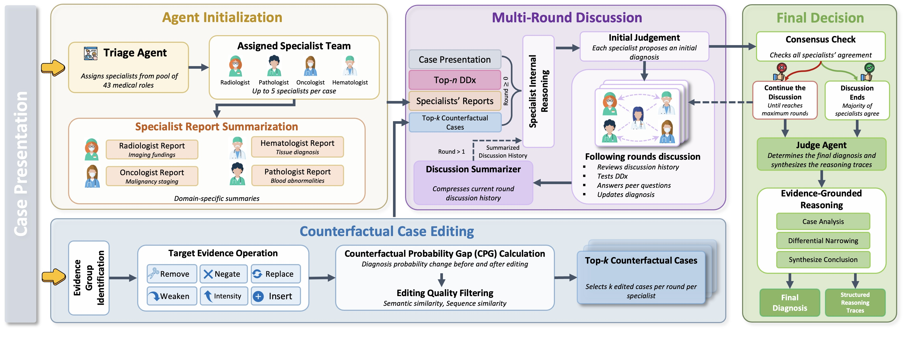

<div align="left">
  <a href="[https://arxiv.org/abs/2503.08890](https://arxiv.org/abs/2603.27820)"></a>
</div>

Official repo of [Improving Clinical Diagnosis with Counterfactual Multi-Agent Reasoning](https://arxiv.org/abs/2603.27820)


## System




---

## Repository layout

```
.
├── cfdx/
│   ├── __init__.py              
│   ├── backends/                # LLM backends
│   │   ├── base.py              #   abstract interface + capabilities
│   │   ├── vllm_backend.py      #   vLLM (OpenAI-compatible) client
│   │   ├── openai_backend.py    #   OpenAI client
│   │   └── __init__.py          #   build_backend() factory
│   ├── llm.py                   # backend-agnostic chat / logprob helpers
│   ├── config.py                # env-driven hyper-parameters
│   ├── prompts.py               # all system prompts
│   ├── utils.py                 # text cleanup, caching, parsing
│   ├── scoring.py               # similarity metrics + combined CF score
│   ├── confidence.py            # logprob
│   ├── counterfactual.py        # CF generation + evaluation
│   ├── agents.py                # triage, DDx, specialist + audit rounds
│   ├── summarize.py             # round / final summary + judge
│   ├── pipeline.py              # end-to-end orchestration
│   └── io_utils.py              # CSV / JSON loading
├── run.py                       # CLI entry point
├── requirements.txt             # client deps (openai, numpy, pandas, sbert)
├── requirements-vllm.txt        # extra deps for self-hosting vLLM
└── LICENSE
```

---

## Install

```bash
conda create -n xor python=3.9 -y
conda activate xor
pip install -r requirements.txt
conda activate trace
```

---

## Configure the backend

### Option A — vLLM

1. Launch a vLLM OpenAI-compatible server for any model of your choice:

   ```bash
   python -m vllm.entrypoints.openai.api_server \
       --model your-model-path \
       --host 127.0.0.1 --port 8004 \
       --generation-config vllm
   ```

   You can swap in any compatible HF model, for example:
   `google/medgemma-1.5-4b-it`, `Qwen/Qwen3-8B`, or a local path

2. Point the client at it:

   ```bash
   export CFDX_BACKEND=vllm
   export VLLM_MODEL=your-model-path
   export VLLM_BASE_URL="http://127.0.0.1:8006/v1"
   ```

### Option B — OpenAI API

```bash
export CFDX_BACKEND=openai
export OPENAI_MODEL=gpt-5-mini     # or gpt-5, gpt-4o, ...
export OPENAI_API_KEY=your API key
```

### Hyperparameters

| Env var       | Default (vLLM) | Default (OpenAI)    |
|---------------|----------------|---------------------|
| `TEMPERATURE` | `0.8`          | `1.0`               |
| `TOP_P`       | `0.95`         | *unset* (omitted)   |
| `MAX_NEW_TOKENS` | `32768`     | `32768`             | 

Example:

```bash
export TEMPERATURE=0.6
export TOP_P=0.9            # for vLLM, or older OpenAI/Azure deployments
export MAX_NEW_TOKENS=16384
python run.py -i your_data/cases.csv -o out.json
```

---

## Input format

A CSV (or JSON list) with at least a case-text column. Recognized columns:

| Purpose              | Accepted names                                       |
|----------------------|------------------------------------------------------|
| Case identifier      | `pmc_id`, `pmcid`, `key`, `id`                       |
| Case presentation    | `case_presentation`, `case_prompt`, `full_information`, `case` |
| Ground-truth label   | `final_diagnosis`, `discharge_diagnosis`, `ground_truth` |

---

## Run

```bash
# Uses CFDX_BACKEND from env
python run.py --input your_data/cases.csv --output results/out.json

# Explicit backend + only the first 10 cases
python run.py -i data/cases.csv -o out.json \
    --backend vllm --limit 10 --max-rounds 3 --num-candidates 2
```

## Citation Information
If you find this work helpful in your research, please consider citing our paper:
```
@article{you2026improving,
  title={Improving Clinical Diagnosis with Counterfactual Multi-Agent Reasoning},
  author={You, Zhiwen and Chen, Xi and Vashishtha, Aniket and Du, Simo and Erion-Barner, Gabriel and Mei, Hongyuan and Peng, Hao and Guo, Yue},
  journal={arXiv preprint arXiv:2603.27820},
  year={2026}
}
```
## Contact Information
If you have any questions, please email `zhiweny2@illinois.edu`.
